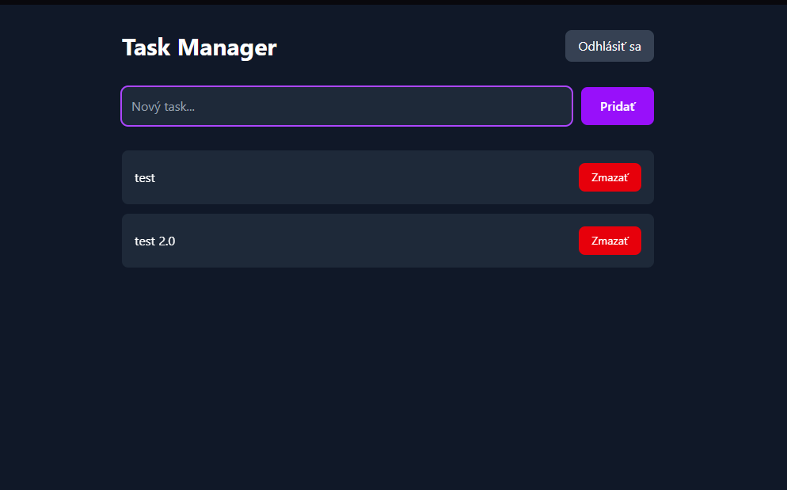

# Task Manager

Fullstack webová aplikácia na správu úloh s autentifikáciou používateľov.

## Demo

<div align="center">
  
  
</div>

## Technológie

**Frontend:** React, Tailwind CSS, Axios  
**Backend:** Node.js, Express  
**Databáza:** MySQL  
**Autentifikácia:** JWT, Bcrypt

## Funkcie

- Registrácia a prihlásenie používateľov
- Každý používateľ vidí len svoje tasky
- Pridávanie, mazanie a označovanie taskov ako hotových
- Ochrana routes pomocou JWT tokenu

## Spustenie lokálne

### Backend

```bash
cd backend
npm install
node index.js
```

### Frontend

```bash
cd frontend
npm install
npm run dev
```

> Potrebuješ mať spustený MySQL server a vytvorenú databázu `task_manager`.
